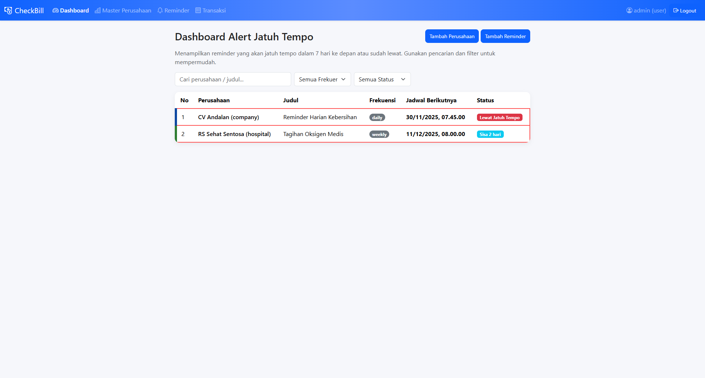
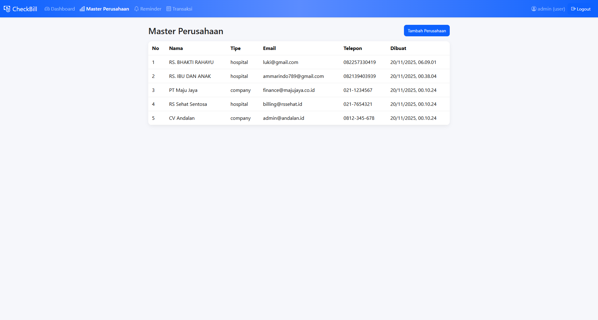
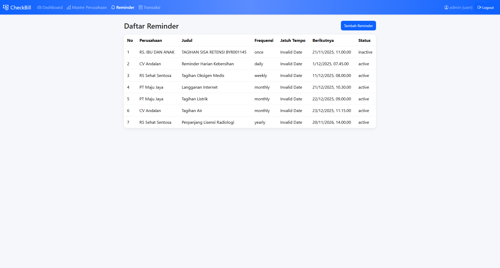
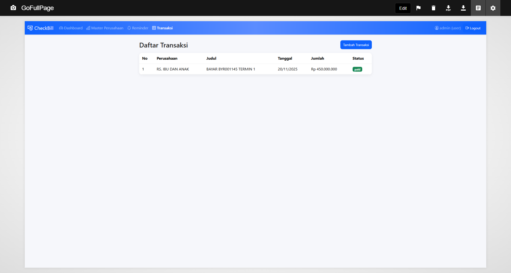

# CheckBill — Panduan Instalasi & Penggunaan

CheckBill adalah aplikasi billing reminder yang menampilkan pengingat jatuh tempo (harian/mingguan/bulanan/tahunan) dengan dashboard, master perusahaan, reminder, dan transaksi. Aplikasi ini mendukung instalasi di localhost (Laragon/XAMPP) maupun server hosting/cPanel.

## Prasyarat
- Node.js 18+ terpasang
- MySQL aktif (localhost atau server)
- Informasi koneksi MySQL: host, nama database, user, password
- Kode beli (lisensi) yang disuplai oleh programmer

## Instalasi di Localhost
1. Ekstrak atau clone proyek ke folder lokal.
2. Buka terminal di folder proyek.
3. Install dependensi:
   ```bash
   npm install
   ```
4. Jalankan aplikasi:
   ```bash
   npm start
   ```
5. Buka `http://localhost:3000/setup` di browser.
6. Isi form Setup:
   - `MySQL Host`: contoh `127.0.0.1`
   - `Nama Database`: contoh `checkbilldb`
   - `User`: contoh `root`
   - `Password`: contoh `asdfQWER789` (sesuaikan dengan MySQL Anda)
   - `Kode Beli`: masukkan kode yang diberikan oleh programmer
   - `Akun Admin`: isi username & password admin
7. Klik “Jalankan Setup”, lalu login di `http://localhost:3000/login`.

## Instalasi di Server Hosting/cPanel
1. Buat database dan user MySQL di cPanel, catat host (sering `localhost`), nama DB, user, password.
2. Deploy kode aplikasi ke server (cPanel Application Manager atau Node.js support). Pastikan Node.js versi 18+.
3. Jalankan aplikasi dan buka `https://domain-anda/setup`.
4. Isi form Setup dengan kredensial MySQL cPanel dan masukkan `Kode Beli`.
5. Selesai setup, login di `https://domain-anda/login`.

## Tentang Setup & Lisensi
- Sebelum dapat digunakan, aplikasi menampilkan halaman Setup untuk:
  - Konfigurasi MySQL
  - Validasi `Kode Beli`
  - Pembuatan akun admin pertama
- Setelah berhasil, status instalasi disimpan dan aplikasi akan meminta login sebelum akses fitur.

## Menyediakan Kode Beli (untuk Programmer)
Masukkan kode beli ke tabel `license_keys` di database target:
```sql
INSERT INTO license_keys (code, status, note)
VALUES ('KODE-BELI-ANDA', 'unused', 'Distribusi batch');
```
- Saat setup, user memasukkan `KODE-BELI-ANDA`. Sistem akan mengaktifkan kode (`status = 'active'`).
- Untuk menonaktifkan kode, set `status = 'revoked'`.

## Fitur Utama
- Dashboard tabel: pencarian, filter frekuensi, filter status, penomoran otomatis.
- Master Perusahaan: tambah perusahaan dengan tipe `company`/`hospital`.
- Reminder: jadwal `once/daily/weekly/monthly/yearly` dengan tanggal dan waktu.
- Transaksi: pencatatan transaksi perusahaan.

## Perintah Dasar
- Jalankan aplikasi: `npm start`
- Port default: `3000`

## Troubleshooting
- Port `3000` sudah digunakan:
  - Tutup proses Node lain, atau jalankan dengan variabel `PORT` berbeda.
- Gagal koneksi MySQL:
  - Periksa host, user, password, nama DB; pastikan database dapat diakses dari server.
- Kode beli tidak valid:
  - Pastikan kode sudah ditambahkan ke tabel `license_keys` dan belum `revoked`.
- Loop kembali ke Setup:
  - Pastikan form setup sukses; cek file konfigurasi dan tabel `app_settings` (kolom `installed = 1`).

## Keamanan
- Jangan membagikan `Kode Beli` ke pihak lain.
- Gunakan password admin yang kuat dan ubah secara berkala.
- Simpan kredensial database dengan aman dan batasi akses.

## Upgrade
1. Hentikan aplikasi (mis. stop proses Node/PM2).
2. Update kode (pull/deploy versi baru).
3. Jalankan `npm install` bila ada dependensi baru.
4. Jalankan `npm start` kembali.

## Kontak
Untuk bantuan lisensi dan instalasi, hubungi programmer penyedia kode beli.

## Bagaimana Cara Menggunakan
Login at http://localhost:3000/login with one of:
- superadmin / super123 (full access, can manage users and delete data)
- adminuser / admin1234 (admin role, restricted compared to super admin)
- admin / admin123 (if created first on a fresh DB)

## Seeder & Trial
- Database dan tabel akan dibuat otomatis saat aplikasi berjalan pertama kali.
- Data contoh otomatis di-seed: beberapa `companies`, `reminders`, dan akun default.
- Akun default:
  - `superadmin / super123` (role: `super_admin`)
  - `adminuser / admin1234` (role: `admin`)
  - `admin / admin123` (dibuat hanya jika tabel `users` awalnya kosong)
- Tidak perlu menjalankan seed manual — cukup jalankan aplikasi dan lakukan Setup.

## Screenshots
- Berikut tampilan hasil aplikasi untuk trial:
  - Dashboard, Master Perusahaan, Reminder, dan Transaksi.

<p align="center">
  
  <br/>
  
  <br/>
  
  <br/>
  
</p>

## Donasi (ID)
- Mendukung pengembangan open source Ammarindo Solution.
- Link donasi: https://www.paypal.com/ncp/payment/7GX4CF5VTZC4S
- Donate to Ammarindo Solution – Open Source Support
- 

## Donations (EN)
- Support Ammarindo Solution open source development.
- Donation link: https://www.paypal.com/ncp/payment/7GX4CF5VTZC4S
- Donate to Ammarindo Solution – Open Source Support
- 
